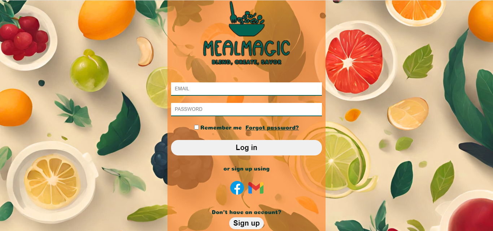
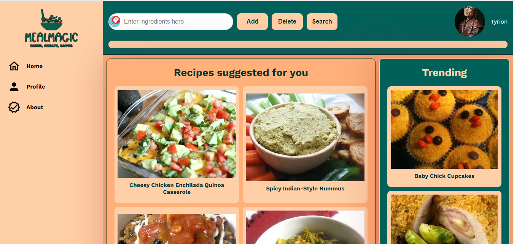
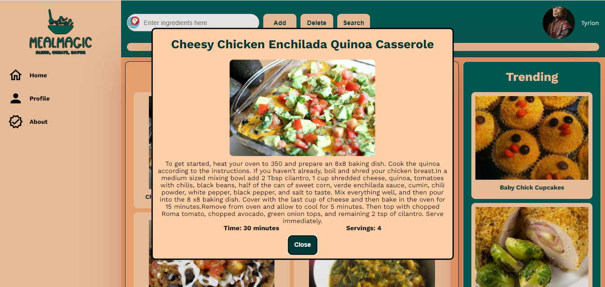
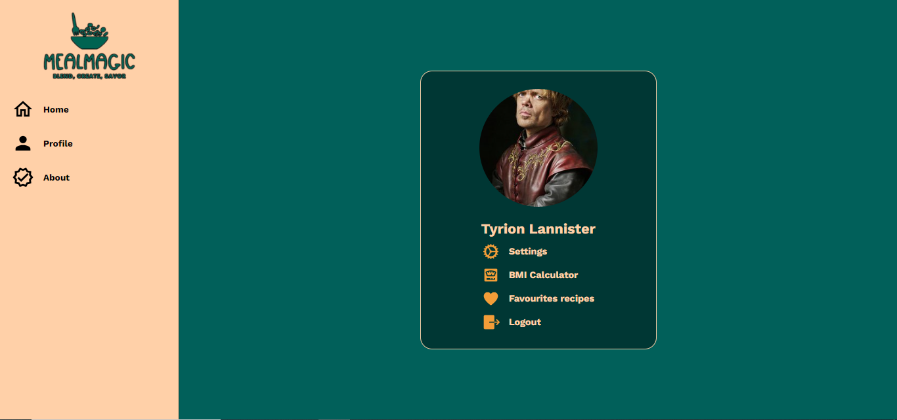

# MealMagic - Recipe App

## Table of contents
* [General info](#general-info)
* [Technologies](#technologies)
* [Features](#features)
* [Screenshots](#screenshots)

## General info
MealMagic is a practical application that inspires you to create tasty dishes using the ingredients you already have, providing a variety of culinary options. This is not a typical application with recipes, but more of a tool that helps when we run out of ideas for a dish using specific ingredients that we currently have. This app was created during "Introduction to web application design" classes as a final project.

## Technologies
Project is created with:
* PHP version: 7.4.3-fpm-alpine3.11
* NGINX version: 1.17.8-alpine
* POSTGRES
* JAVASCRIPT
* HTML
* CSS
* DOCKER
* SPOONACULAR API

## Features
MealMagic offers a variety of features to help you discover and create delicious meals:

* **User Authentication**: Users can register, login, and logout using session-based authentication.
* **Ingredient-Based Recipe Search**: Users can search for recipes based on the ingredients they have on hand.
* **Recipe Suggestions**: The application provides a variety of culinary options, helping users discover new recipes.
* **User Profile Customization**: Users can customize their profiles, including the ability to set a custom avatar.
* **User Favorites Recipes**: Users can add recipes to their favorites and display them.
* **User BMI calculator**: Users can calculate their BMI, system store it in database and display on user page.
* **Integration with Spoonacular API**: The application leverages the Spoonacular API to provide a vast array of recipes.
* **Responsive Design**: The application is designed to work well on both desktop and mobile devices.
* **Dockerized Application**: The application is containerized using Docker, making it easy to set up and run in any environment.

## Screenshots
**Login page**

**Home page**

**Recipe modal**

**User page**
